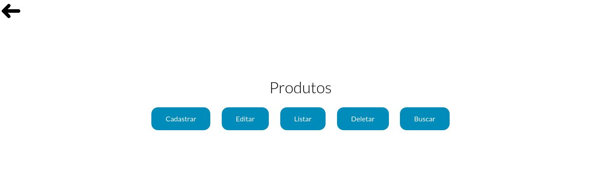

# ProdutosFirebase

<p align="center">
  
</p>

<p align="center">
  <a href="https://forthebadge.com">  </a>
  <a href="https://forthebadge.com">  </a>
  <a href="https://forthebadge.com">  </a>
</p>

## :scroll: Sobre
CRUD de Produtos com Sistema de Cadastro e de Login utilizando HTML + CSS + JS + Firebase.

---

## :rocket: Tecnologias utilizadas
* HTML
* CSS
* JavaScript
* Firebase (Banco de Dados)

---

## :computer: Como baixar, configurar e rodar o projeto
```php
  // Clonar o repositório
  $ git clone https://github.com/jjoaovitor7/ProdutosFirebase

  // Entrar no diretório
  $ cd ProdutosFirebase

  // Criar um Projeto no Firebase (https://console.firebase.google.com/).
  // Criar um Banco de Dados Cloud Firestore (no Firebase).
  // Criar um Aplicativo (web) (no Firebase) e ao criar esse aplicativo você terá acesso à:
  // apiKey, authDomain, projectId, storageBucket, messagingSenderId e ao appId.
  // Substituir os campos nos arquivos .js pelas suas "credenciais".
  // (apiKey, authDomain, entre outros).

```

---
